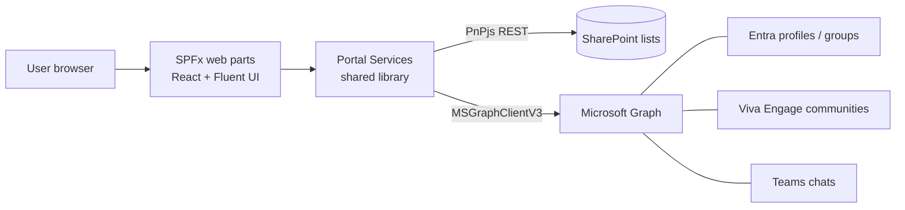

# 01 · Architecture & Information Architecture

> **Spec suite:** Community Governance Portal (SSD Technical Communities · FY27 · v1.0)
> **Source:** `SSD_Communities_Portal_Technical_Specification.docx` §1–4 · **Status:** Draft
> **Related:** [Spec index](../README.md) · [Implementation Plan](../implementation-plan.md) · [Data Model](02-data-model.md)

## 1. Purpose & scope

The portal is the **single source of truth** for the SSD Technical Communities initiative — an H1 FY27 foundation deliverable of the Delivery Transformation Initiative, built as SharePoint Framework client-side components hosted in SharePoint Online.

For each community it defines the **scope, roles, assignments** and the **links to join** that community's Viva Engage community and chat group. It is deliberately **not a conversation surface**: Viva Engage carries persistent announcements, chat carries fast day-to-day support, and the portal is the **directory, register and record** that points at both.

| | |
|---|---|
| **In scope (v1.0)** | Community directory + detail pages; charter authoring + sign-off; role & assignment management; IP alignment; self-service join; health metric capture + reporting; forum retirement register |
| **Out of scope** | Replacing Viva Engage/Teams chat as communication surfaces; hosting learning/certification content; identity administration beyond reading/writing Entra group membership; IP delivery tooling owned by other workstreams |

## 2. Architecture principles

SharePoint-native, **list-backed**, with **no custom middle tier** in v1.0. SPFx web parts run client-side, read/write structured data through **SharePoint lists** on the host site, and call **Microsoft Graph** for anything outside SharePoint (profiles, Entra membership, Viva Engage communities, Teams chats).

Four governing principles:

1. **Keep the operational surface small** — owned by a v-team, not a platform org.
2. **Store every governance record as list data** — queryable, versioned, exportable without bespoke storage.
3. **Treat Graph as a read-mostly integration layer** — writes limited to consented membership operations.
4. **Keep components composable** — a community page is assembled from web parts, not hard-coded.

### Deferred: Azure Function proxy
A future version may add an Azure Function for **elevated Graph operations** and **scheduled metric collection**. v1.0 avoids it deliberately — it adds hosting, secrets and monitoring obligations a v-team should not carry before adoption is proven. See [Risks & Decisions](09-risks-and-decisions.md).

## 3. Technology stack

The supported baseline. **Confirm versions against the tenant's current SharePoint Online build before sprint one** — SPFx and Node compatibility pairs move together.

| Layer | Technology | Notes |
|---|---|---|
| Framework | SharePoint Framework 1.21.1 | Newest supported gulp line; SharePoint Online target |
| UI | React + TypeScript | Function components + hooks; **strict TypeScript** |
| Design system | Fluent UI React | Inherits the SharePoint theme; no bespoke component library (see [Design System](06-design-system.md)) |
| Data access | PnPjs | Wraps SharePoint REST; **batching** for multi-list reads |
| Cross-service | Microsoft Graph via `MSGraphClientV3` | Profiles, Entra groups, Viva Engage communities, Teams chats |
| Data store | SharePoint lists | Provisioned from the solution package; versioning enabled |
| Build | Node 22, gulp, npm | Explicit gulp requirement pins SPFx 1.21.1 |
| Pipelines | Azure DevOps or GitHub Actions | Build & release defined as code in the repo |

> **Toolchain note:** SPFx 1.22+ scaffolds new projects with Heft. The explicit **gulp** requirement therefore pins this implementation to SPFx 1.21.1.

## 4. Information architecture

A **single SharePoint communication site** (not a team site) — a read-mostly publication surface for a wide audience that must **not** create another Microsoft 365 group competing with the Viva Engage communities it points to.

| Page | Purpose | Source |
|---|---|---|
| Home | Community directory (discovery surface) | `Communities` list |
| Community detail | One **templated** page rendered per community | Data-driven from `Communities` |
| Administration | Community Program Manager surface | Portal lists |
| Health dashboard | Portfolio view of the six measures | `HealthMetrics` |

Community detail pages are **data-driven** from the `Communities` list rather than authored individually — **adding a community is a list entry, not a page build**.
