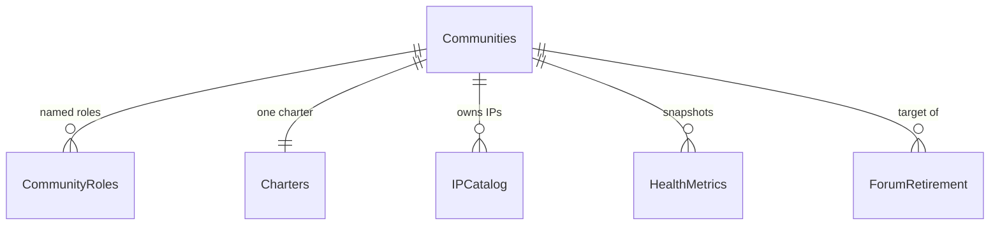
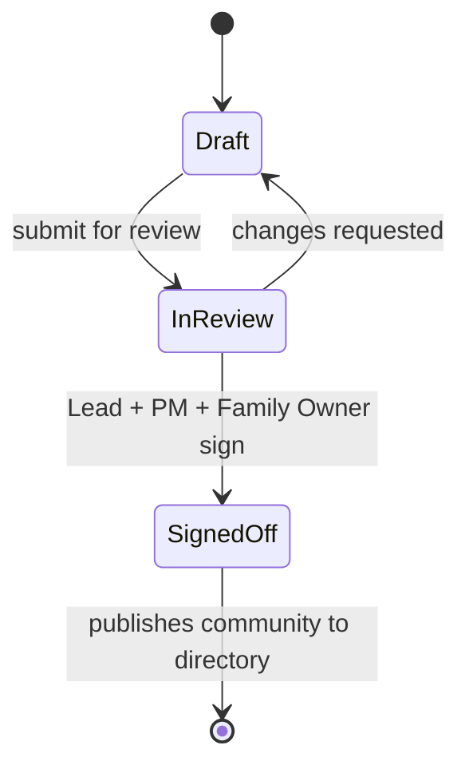

# 02 · Data Model

> **Spec suite:** Community Governance Portal (SSD Technical Communities · FY27 · v1.0)
> **Source:** `SSD_Communities_Portal_Technical_Specification.docx` §5 · **Status:** Draft
> **Related:** [Spec index](../README.md) · [Architecture](01-architecture.md) · [Components](03-components.md)

All governance data lives in **SharePoint lists** on the portal site. Lists are **provisioned from the solution package** so the schema is versioned with the code rather than configured by hand. Every list carries the standard **Created, Modified, Author, Editor** fields, which supply the audit trail without additional design.

## List inventory

| List | Purpose | Cardinality |
|---|---|---|
| **Communities** | The community register: scope, family, channels, status | One item per community |
| **CommunityRoles** | Named people and their role in a community | Many per community |
| **Charters** | The charter record and its sign-off state | One item per community |
| **IPCatalog** | Delivery IPs and their owning community | Many per community |
| **HealthMetrics** | Periodic snapshots of the six health measures | Community × measure × period |
| **ForumRetirement** | Consolidation register and reduction tracking | One item per legacy forum |

## Relationships

`Communities` is the **spine**; every other list references it by lookup.

## Communities (spine)

One item per community — **including the cross-training community**, which is *flagged* rather than modelled separately so it appears in the directory and carries the same governance fields.

| Column | Type | Notes |
|---|---|---|
| Title | Single line of text | Community name, e.g. `Azure`, `Modern-Apps` |
| ServiceFamily | Choice | Service family this community aligns to |
| ScopeInScope | Multiple lines of text | What the community covers |
| ScopeOutOfScope | Multiple lines of text | What it explicitly does not cover; drives overlap review |
| VivaEngageGroupId | Single line of text | Backing M365 group id; used for join & membership state |
| VivaEngageUrl | Hyperlink | Deep link to the private community |
| ChatGroupUrl | Hyperlink | Deep link to the support chat group |
| TargetRoles | Choice (multi) | Roles the community is right-sized for |
| IsCrossCommunity | Yes/No | Flags the cross-training community |
| Status | Choice | `Proposed` · `Chartered` · `Active` · `Merged` · `Retired` |
| LaunchDate | Date | Anchors the health baseline period |

## CommunityRoles

Roles are held as **separate items** (rows), not person columns on the community, because a community has one Community Lead but **several Family Owners — one per time zone** — plus a variable set of invited experts. Rows keep the time-zone dimension queryable and let the portal show **coverage gaps**.

| Column | Type | Notes |
|---|---|---|
| Community | Lookup → Communities | Parent community |
| Person | Person or group | Resolves against Entra; **never a free-text name** |
| Role | Choice | `Community Lead` · `Family Owner (SME)` · `Invited Expert` |
| TimeZone | Choice | **Required for Family Owners**; drives the coverage view |
| SourceOrg | Choice | `IP Dev Team` · `CSAM Strategy Org` · `Adoption` · `Delivery` |
| Active | Yes/No | Retains history when a role holder changes |

## Charters

The charter is the **launch gate**. Each community has **exactly one** charter item carrying the scope statement, working model, launch-readiness flags and three sign-offs. **A community cannot be published to the directory until its charter status reaches `Signed off`.**

| Column | Type | Notes |
|---|---|---|
| Community | Lookup → Communities | One charter per community, enforced by validation |
| InteractionModel | Multiple lines of text | The approach the community chose for itself |
| Cadence | Single line of text | Session frequency and office-hours pattern |
| ReadinessPlan | Multiple lines of text | Readiness & certification plan for the domain |
| LaunchReadiness | Choice (multi) | The **six** readiness conditions, each ticked when met |
| Status | Choice | `Draft` · `In review` · `Signed off` (gates publication) |
| SignOffLead / SignOffPM / SignOffFamilyOwner | Person + Date pairs | Three sign-offs; **the PM signature records the overlap review** |
| CharterVersion | Single line of text | List versioning retains the full history |

## HealthMetrics

Stored as **periodic snapshots** rather than live values, so quarterly checkpoints compare like with like. One item per community per measure per period; the launch snapshot is flagged as the **baseline**.

| Column | Type | Notes |
|---|---|---|
| Community | Lookup → Communities | Parent community |
| Measure | Choice | `Participation` · `Contribution` · `Responsiveness` · `Knowledge reuse` · `Belonging` · `Cross-pollination` |
| Period | Choice | `Baseline` · `Q2 FY27` · `Q3 FY27` · `Year-end FY27` |
| Value | Number | The recorded figure |
| Unit | Choice | `Percent` · `count` · `hours` · `score` |
| IsBaseline | Yes/No | Marks the launch snapshot for comparison |
| Commentary | Multiple lines of text | Context for a movement; keeps the dashboard honest |

## Supporting lists

**IPCatalog** — one item per delivery IP with its owning community, supporting the *build-once, share-everywhere* rule by making a shared IP visible across the communities that consume it.

**ForumRetirement** — the consolidation register: one item per existing forum, distribution list or channel, with a **disposition** (`Migrate` · `Merge` · `Close`), the **target community**, and a **completion date**. The reduction target is reported from this list.

## Provisioning, validation & indexing

- **Schema-as-code:** all lists provisioned from the package with versioning enabled; no manual field configuration.
- **Validation rules:** exactly one `Charters` item per community; `Charters.Status = Signed off` **gates directory publication**; `CommunityRoles.TimeZone` required when `Role = Family Owner (SME)`.
- **Indexing (list-threshold safety):** index every **lookup** and **filter** field — `Communities.ServiceFamily/Status/Title`, `CommunityRoles.Community/Role/TimeZone`, `Charters.Community/Status`, `IPCatalog.Community`, `HealthMetrics.Community/Period/Measure`, `ForumRetirement.Disposition`. No query may exceed the list view threshold (see [NFRs](07-nfr-and-quality.md)).
- **TypeScript models:** generate typed models mirroring each list as the single source of truth for [Portal Services](03-components.md).
