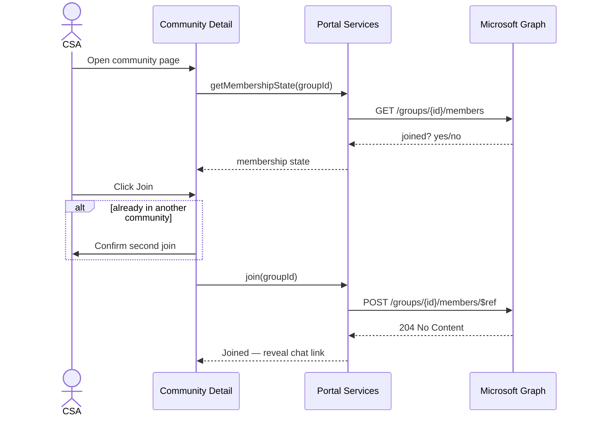

# 03 · Components & User Journeys

> **Spec suite:** Community Governance Portal (SSD Technical Communities · FY27 · v1.0)
> **Source:** `SSD_Communities_Portal_Technical_Specification.docx` §6, §9 · **Status:** Draft
> **Related:** [Spec index](../README.md) · [Data Model](02-data-model.md) · [Graph Integration](04-graph-integration.md) · [Security](05-security-permissions.md)

The solution ships as **one SPFx package** containing the web parts and the shared library below. Components share a common services layer so that list access, Graph calls and caching are **written once**.

## Component inventory

| Component | Type | Purpose |
|---|---|---|
| **Community Directory** | Client-side web part | Card grid of all communities; filter by family, topic, role — the discovery surface |
| **Community Detail** | Client-side web part | Scope, named roles by time zone, owned IPs, channel links and the **join action** |
| **My Community** | Client-side web part | The user's membership and quick links; reinforces single-community focus |
| **Charter Editor** | Client-side web part | Nine-section form, readiness checklist and the three-way sign-off workflow |
| **Health Dashboard** | Client-side web part | Portfolio view of the six measures against baseline, by community and period |
| **Retirement Register** | Client-side web part | Forum inventory, disposition tracking and progress against the reduction target |
| **Portal Services** | Shared library | List access, Graph calls, caching, permission checks and telemetry, written once |

## Build matrix

| Component | Reads | Writes | Graph | Key logic | Enforced role |
|---|---|---|---|---|---|
| Community Directory | Communities | — | photos (optional) | Card grid; filter family/topic/role; warm-cache < 2s | Member (Read) |
| Community Detail | Communities, CommunityRoles, IPCatalog | group membership | `User.Read.All`, `GroupMember.ReadWrite.All` | Roles by time zone; IPs; **join**; single-community confirm on 2nd join | Member (Read) |
| My Community | CommunityRoles, Communities | — | membership state | User's membership + quick links | Member (Read) |
| Charter Editor | Charters, Communities | Charters | `People.Read` | Nine sections; six-item readiness; **three-way sign-off**; publication gate | Community Lead / Subject Matter Expert / PM |
| Health Dashboard | HealthMetrics, Communities | — | — | Six measures vs baseline, by community & period | PM, Exec Sponsor (Read) |
| Retirement Register | ForumRetirement | ForumRetirement | — | Inventory; disposition; **progress vs reduction target** | Program Manager |

> **Recommended build order (dependency-driven):** Directory → Community Detail + join → My Community → Charter Editor + sign-off → Health Dashboard → Retirement Register. See the [Implementation Plan](../implementation-plan.md) §7.

## Portal Services (shared library)

Everything the six web parts depend on — written and tested once:

- **List access (PnPjs):** typed CRUD per list, **batched** multi-list reads, paging, `$select`/`$filter` on indexed columns, retry.
- **Graph access (`MSGraphClientV3`):** profiles, group membership read + join, group properties, people picker (see [Graph Integration](04-graph-integration.md)).
- **Caching:** warm-cache strategy for the directory NFR; invalidate on write.
- **Permission checks:** resolve current user role → capability map (UX gating only; real enforcement is list-level — see [Security](05-security-permissions.md)).
- **Telemetry:** page views, joins, charter transitions → feeds the Participation health measure.
- **Localization:** strings externalised from the first commit (English at launch).

## Key user journeys

### Discover & join
A CSA opens the home page, filters the directory by service family or topic, opens a community detail page, reads the scope and named roles, and joins. The **join action adds them to the Viva Engage community's backing group** and surfaces the chat group link. The **single-community principle** is reinforced: the portal shows which community the user already belongs to and **asks for confirmation before a second join** rather than blocking it.

### Author a charter
A Community Lead opens the charter editor, completes the nine sections, and submits for review. The Program Manager receives the review task, **checks for scope overlap** against neighbouring communities, and signs off alongside the lead and one nominated Subject Matter Expert. Status moves `Draft → In review → Signed off`; **only the final state publishes the community** to the directory.

### Record health
At launch and each quarterly checkpoint the Community Lead enters the six measures for their community. The dashboard renders the portfolio view for the Program Manager and Executive Sponsor, comparing each period against the **launch baseline**.

### Retire a forum
The Program Manager registers an existing forum, assigns a **disposition** and a **target community**, and records completion. The dashboard reports **progress against the published reduction target**.
