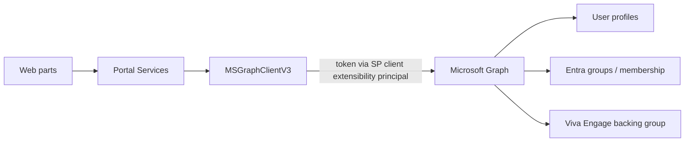

# 04 · Microsoft Graph Integration

> **Spec suite:** Community Governance Portal (SSD Technical Communities · FY27 · v1.0)
> **Source:** `SSD_Communities_Portal_Technical_Specification.docx` §7 · **Status:** Draft
> **Related:** [Spec index](../README.md) · [Components](03-components.md) · [Security](05-security-permissions.md) · [Risks & Decisions](09-risks-and-decisions.md)

Graph is called through the SPFx **`MSGraphClientV3`**, which handles token acquisition against the tenant-wide **SharePoint Online Client Extensibility Web Application Principal**. Permissions are requested in the solution manifest and **must be approved by a tenant administrator** in the SharePoint admin centre before the portal functions.

> **This approval is a deployment dependency, not a runtime one** — secure it before the first release. Raise the request in **Sprint 0** (longest lead item).

## Permission set

Deliberately minimal: where a read-only alternative exists it is preferred, and no permission is requested for a capability v1.0 does not use.

| Permission | Type | Why it is needed | Degradation if withheld |
|---|---|---|---|
| `User.Read.All` | Delegated | Resolve role holders; show photos and job titles on community pages | Names only, no photos/titles |
| `GroupMember.ReadWrite.All` | Delegated | Read membership state and perform the **join** against the backing group | **Link-only join**, no membership state |
| `Group.Read.All` | Delegated | Read the Viva Engage community's backing group properties | Hide derived group info |
| `Sites.Read.All` | Delegated | Cross-site reads if the portal later surfaces content from other sites | No impact in v1.0 |
| `People.Read` | Delegated | People pickers when assigning roles | Basic search fallback |
| **Approval** | Tenant admin | Granted once on the SharePoint admin centre **API access** page | — (release dependency) |

## Integration principles

- **Read-mostly:** Graph is an integration layer for data outside SharePoint. **Writes are limited to consented membership operations** (the join action).
- **All calls via Portal Services:** no web part calls Graph directly; token handling, batching and error/degradation logic live in the shared library (see [Components](03-components.md)).
- **Graceful degradation:** a feature flag disables membership features and falls back to **link-only join** so a delayed permission grant never blocks release.

## What Graph is **not** used for

Viva Engage communities are **private**; the portal never renders their content. Graph surfaces **membership state** and enables the **join** (adding the user to the backing M365 group) — not conversation data. See [Security](05-security-permissions.md).
