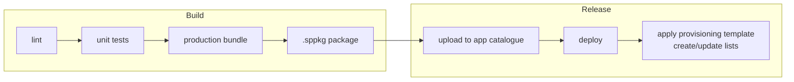

# 08 · Build, Deployment & Environments

> **Spec suite:** Community Governance Portal (SSD Technical Communities · FY27 · v1.0)
> **Source:** `SSD_Communities_Portal_Technical_Specification.docx` §11–12 · **Status:** Draft
> **Related:** [Spec index](../README.md) · [Implementation Plan](../implementation-plan.md) · [Risks & Decisions](09-risks-and-decisions.md)

## Toolchain

The explicit gulp requirement uses **SPFx 1.21.1**, the newest supported gulp line, with **npm** for dependencies. SPFx 1.22+ scaffolds new projects with Heft. The **repository holds everything as code** — web part source, list schema definitions, the provisioning template and the pipeline definition — so a new environment is stood up from source, not by manual configuration.

> **Prerequisites (Sprint 0):** pin **Node to the SPFx compatibility matrix** (currently Node 22.x) and point npm at the **approved internal registry** — the public registry is network-filtered here. See [Risks & Decisions](09-risks-and-decisions.md) and the [Implementation Plan](../implementation-plan.md) §3.

## Pipelines (defined as code)

- **Build pipeline:** lint → unit tests → production bundle → solution package.
- **Release pipeline:** upload the package to the app catalogue → deploy → apply the site provisioning template (create/update lists).
- **Every environment uses these pipelines — no environment is configured by hand, including development.**
- Assets served from the **Office 365 CDN** where enabled, falling back to a SharePoint library.
- v1.0 targets a **single site** — scope accordingly; deploy tenant-wide **only** if the portal must appear on multiple sites.

## Environments

| Environment | Purpose | Deployment target |
|---|---|---|
| **Development** | Feature work and local debugging | Microsoft 365 developer tenant **or** an isolated site collection with its own app catalogue |
| **Test** | Integration testing and Family Owner review | **Site collection** app catalogue in the production tenant, scoped to the test site |
| **Production** | The live portal | **Tenant** app catalogue, scoped to the portal site |

## Release dependencies

- **Graph permission grant** approved in the SharePoint admin centre before first production release (see [Graph Integration](04-graph-integration.md)).
- **Portal site provisioned** with the v-team as site owners.
- **App catalogues** available for each environment above.
